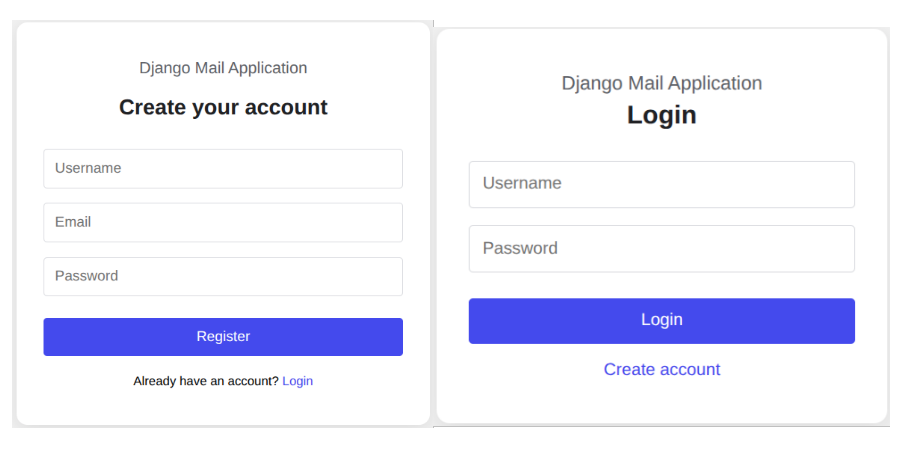
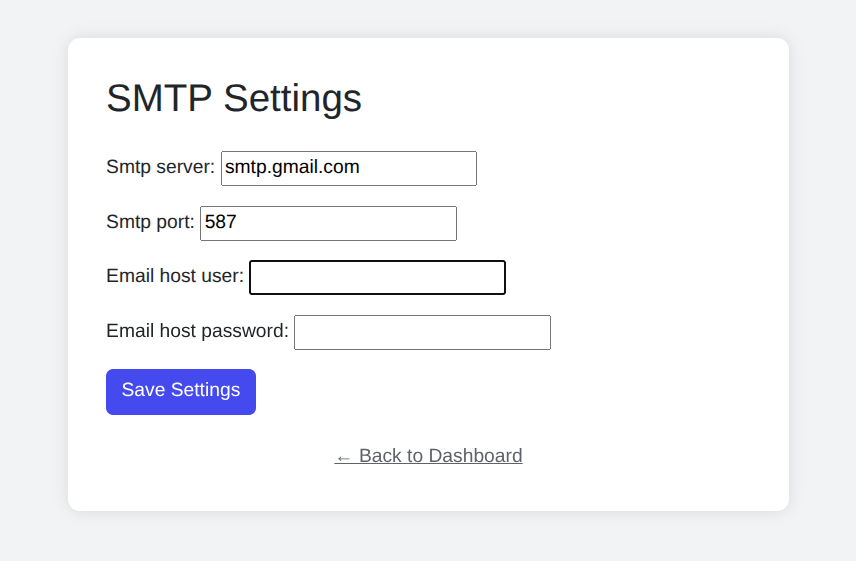
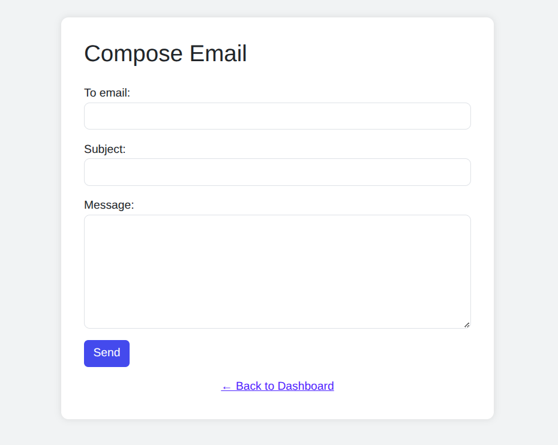
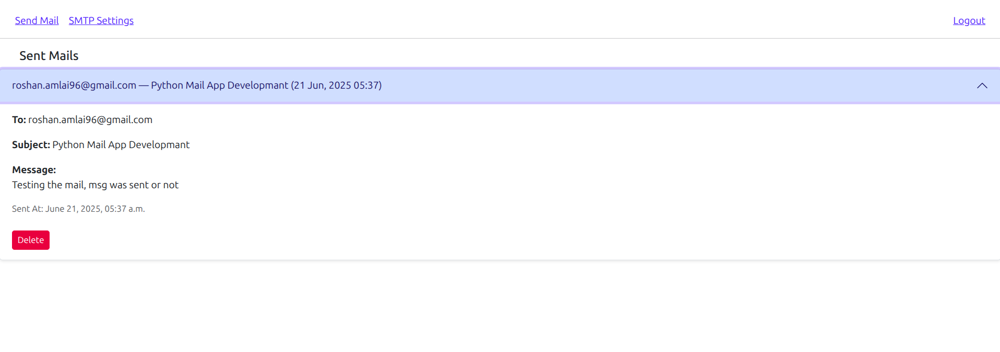

# Django Mail App

The Django Mail App is a user-friendly web application that allows users to send emails using custom SMTP settings. It features user registration, login, SMTP configuration, email sending, sent mail history, and a clean dashboard — all built using Django.

---

## Features

-  User Registration & Login System
-  Send Emails via Gmail or any SMTP server
-  SMTP Settings Form (per user)
-  Sent Mail History Tracking
-  Delete Sent Emails
-  Simple and Clean UI (user-friendly)
-  Built with Django, Python, HTML, CSS

---

## Project Setup & Installation

1. **Clone the Repository**:
   ```bash
   git clone https://github.com/RoshanSharma7/Mail-Application
   ```

2. **Create a Virtual Environment**:
   ```
   python -m venv venv
   source venv/bin/activate  
   venv\Scripts\activate      # On Windows use
   ```

3. **Install Dependencies**:
   ```
   pip install -r requirements.txt
   ```

4. **Apply Migrations**:
   ```
   python manage.py makemigrations
   python manage.py migrate
   ```

5. **Run the Server**:
   ```
   python manage.py runserver
   Visit: http://127.0.0.1:1800
   ```

 ---

 ## How to Generate Gmail App Password:
 To send emails through Gmail SMTP:

- Go to Google Account Security.
- Enable 2-Step Verification.
- Scroll to "App Passwords".
- Select app as "Mail", device as "Other", and generate.
- Copy the 16-character password and use it in SMTP Settings.

---

## How to Save SMTP Settings
- Log in to the Mail App.
- Click on SMTP Settings in the dashboard.
- Fill in the following:
  - SMTP Server: smtp.gmail.com
  - Port: 587
  - Email: your_email@gmail.com
  - App Password: (the 16-character password from above)
- Click Save.
- Now you can send emails securely.

---

## How to Delete Sent Mails
- Go to the Dashboard.
- Under "Sent Mails", each email has a delete button.
- Click on it to permanently remove the record from the database.

---

## Screenshots
#### Login & Registreation:


#### Setting SMTP:


#### Send Mail:


#### Sent Mail:


---

## Collaboration & Contribution
We welcome contributions from developers, designers, and tech enthusiasts around the world!

### How to Contribute:
- Fork the repository
- Create a new feature or bugfix branch
- Commit your changes with a clear message
- Push to your forked repo
- Open a pull request
All contributions will be reviewed, credited, and greatly appreciated.

If you're interested in collaborating with the developer on future Django projects, reach out via email or GitHub; all important links are mentioned at the bottom.

---

## License:

This project is licensed under the [MIT License](https://github.com/RoshanSharma7/Mail-Application/License.md).

---

## Developer Info
### Roshan Sharma | Software Engineer 
- **GitHub**: [RoshanSharma7](https://github.com/RoshanSharma7)
- **LinkedIn**: [RoshanSharma7](https://www.linkedin.com/in/roshan-sharma7)
- **Instagram**: [iamroshansharma7](https://www.instagram.com/iamroshansharma7/)
- **Email**: roshan.amlai96@gmail.com

Follow me on all Social Media platforms for better communication.
   
